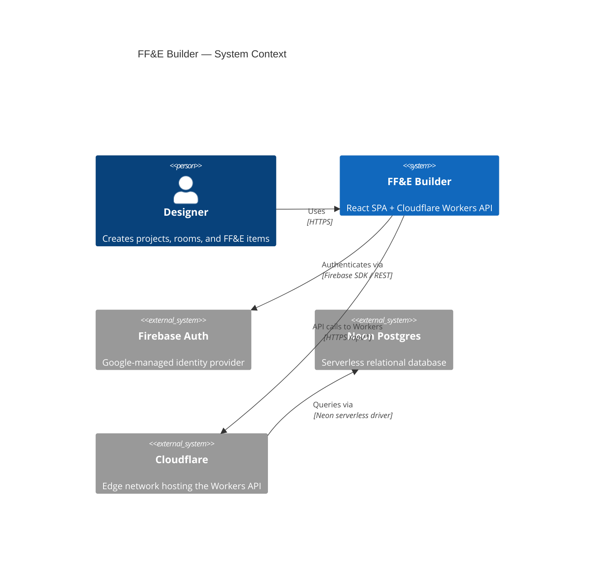

# FF&E Builder

> Specification management for interior designers — organize furniture, fixtures & equipment across projects, rooms, and vendors.


---

## Quick start

**Prerequisites:** Node 20+, pnpm 9+

```bash
pnpm install
cp .env.example .env.local   # then fill in your credentials
pnpm dev
```

Open [http://localhost:5173](http://localhost:5173).

---

## Architecture at a glance



For component diagrams, sequence diagrams, and the ERD see [docs/architecture.md](docs/architecture.md).

---

## UI surfaces

- Project header and design-system primitives provide the first editable project surface.
- `ItemsTable` renders FF&E items with rooms grouped, persisted room collapse state, room subtotals, a sticky grand total, and inline editing for item fields while keeping derived totals read-only.

## Frontend deploy notes

- GitHub Pages serves the Vite app from `/ff-e-builder/`.
- The frontend build now emits stable asset filenames in `dist/assets/` so a new
  Pages deploy does not leave the browser pointing at a removed hashed bundle
  from the previous release.

---

## Project structure

```
/
├── src/               # React + Vite front-end (TypeScript)
│   ├── components/    # Shared UI components
│   ├── features/      # Feature-sliced modules (projects, rooms, items…)
│   ├── hooks/         # Custom React hooks
│   ├── lib/           # Client-side utilities (auth, API client, formatters)
│   ├── test/          # Vitest setup and unit tests
│   └── vite-env.d.ts  # Vite client-types reference
├── tests/
│   └── e2e/           # Playwright end-to-end tests
├── public/            # Static assets (Vite copies to dist/)
│   └── 404.html       # GitHub Pages SPA redirect script
├── api/               # Cloudflare Workers API (TypeScript) — Phase 2
│   └── routes/        # Hono route handlers
├── db/                # Database layer (Drizzle ORM) — Phase 2
│   ├── migrations/    # SQL migration files — never run from client
│   └── schema.ts      # Drizzle schema (source of truth for DB types)
├── docs/              # Project documentation
│   └── adr/           # Architecture Decision Records
├── .github/
│   └── workflows/     # ci.yml (PR gates) + deploy.yml (main → gh-pages)
├── .env.example       # Required environment variables (no secrets)
├── AGENTS.md          # Canonical rules for all AI agents
├── vite.config.ts     # Vite + Vitest config
├── tailwind.config.ts # Tailwind v3 design tokens
├── playwright.config.ts
└── README.md          # This file
```

---

## Where to go next

| Audience             | Resource                                     |
| -------------------- | -------------------------------------------- |
| AI agents & Codex    | [AGENTS.md](AGENTS.md)                       |
| Engineers onboarding | [docs/architecture.md](docs/architecture.md) |
| Ops / deployment     | [docs/runbook.md](docs/runbook.md)           |
| Changelog            | [docs/changelog.md](docs/changelog.md)       |
| Contributing         | [docs/contributing.md](docs/contributing.md) |
