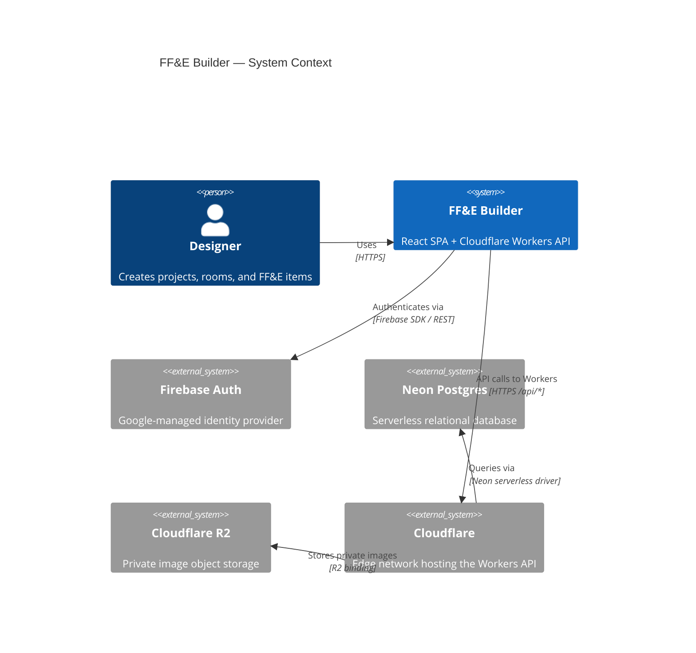

# FF&E Builder

> Specification management for interior designers — organize furniture, fixtures & equipment across projects, rooms, and vendors.


---

## Quick start

**Prerequisites:** Node 20+, pnpm 9+

```bash
pnpm install
cp .env.example .env.local   # then fill in your credentials
pnpm dev
```

Open [http://localhost:5173](http://localhost:5173).

---

## Architecture at a glance



For component diagrams, sequence diagrams, and the ERD see [docs/architecture.md](docs/architecture.md).

---

## UI surfaces

- **Project header** — editable project name, client name, and budget with a live budget tracker.
- **Table** (`/projects/:id/table`) — FF&E items grouped by room with persisted collapse state, room subtotals, a sticky grand total, inline editing, structure mutations (add/duplicate/move/delete/reorder), per-room and full-project export (CSV, Excel, PDF), and Excel import with column-mapping wizard.
- **Catalog** (`/projects/:id/catalog`) — printable one-item-per-page FF&E catalog with A4 page proportions, grouped navigation, "Print" (browser dialog) and "Export PDF" (direct download) buttons, and a per-item PDF export.
- **Summary** (`/projects/:id/summary`) — room subtotals, budget progress, status counts, vendor totals, and CSV/Excel/PDF export.
- **Materials** (`/projects/:id/materials`) — project-specific material libraries store an image swatch, ID, and description, then assign multiple materials to items from the library or Add Item drawer and catalog pages. See [docs/materials.md](docs/materials.md).
- **Images** — project, room, and item image metadata is stored in Neon; image bytes live in the private Cloudflare R2 `ffe-images` bucket behind the API Worker. See [docs/images.md](docs/images.md).

## Frontend deploy notes

- GitHub Pages serves the Vite app from `/ff-e-builder/`.
- The frontend build now emits stable asset filenames in `dist/assets/` so a new
  Pages deploy does not leave the browser pointing at a removed hashed bundle
  from the previous release.
- The build also publishes a compatibility copy for the known stale bundle name
  `assets/index-BD_UO_br.js`; this lets browsers with a cached older
  `index.html` recover instead of loading a blank page from a 404 script.

---

## Project structure

```
/
├── src/               # React + Vite front-end (TypeScript)
│   ├── components/    # Domain-aware UI components (ItemsTable, CatalogView, …)
│   │   └── primitives/  # Generic design-system atoms (Button, Modal, Drawer, …)
│   ├── hooks/         # Custom React hooks with barrel export (index.ts)
│   ├── lib/           # Client-side utilities (API client, calc, export/import, …)
│   ├── types/         # Shared TypeScript types with barrel export (index.ts)
│   ├── data/          # Static fixture data (demo seed)
│   ├── test/          # Vitest global setup
│   └── vite-env.d.ts  # Vite client-types reference
├── tests/
│   └── e2e/           # Playwright end-to-end tests
├── public/            # Static assets (Vite copies to dist/)
│   └── 404.html       # GitHub Pages SPA redirect script
├── api/               # Cloudflare Workers API (TypeScript)
│   └── src/
│       ├── routes/    # Hono route handlers (projects, rooms, items, images)
│       ├── middleware/ # Auth middleware (Firebase JWT verification)
│       └── lib/       # Worker-only utilities (db, firebase-auth, ownership)
├── db/
│   └── migrations/    # SQL migration files — apply via `pnpm db:migrate`, never from client
├── docs/              # Project documentation
│   └── adr/           # Architecture Decision Records
├── .github/
│   └── workflows/     # ci.yml (PR gates) + deploy.yml (main → gh-pages)
├── .env.example       # Required environment variables (no secrets)
├── AGENTS.md          # Canonical rules for all AI agents
├── vite.config.ts     # Vite + Vitest config
├── tailwind.config.ts # Tailwind v3 design tokens
├── playwright.config.ts
└── README.md          # This file
```

---

## Where to go next

| Audience             | Resource                                           |
| -------------------- | -------------------------------------------------- |
| AI agents & Codex    | [AGENTS.md](AGENTS.md)                             |
| Engineers onboarding | [docs/architecture.md](docs/architecture.md)       |
| Ops / deployment     | [docs/runbook.md](docs/runbook.md)                 |
| Accessibility        | [docs/accessibility.md](docs/accessibility.md)     |
| Privacy              | [docs/privacy.md](docs/privacy.md)                 |
| Troubleshooting      | [docs/troubleshooting.md](docs/troubleshooting.md) |
| Changelog            | [docs/changelog.md](docs/changelog.md)             |
| Contributing         | [docs/contributing.md](docs/contributing.md)       |
