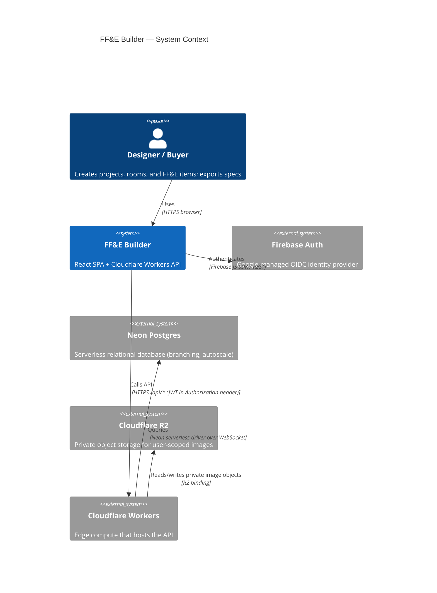
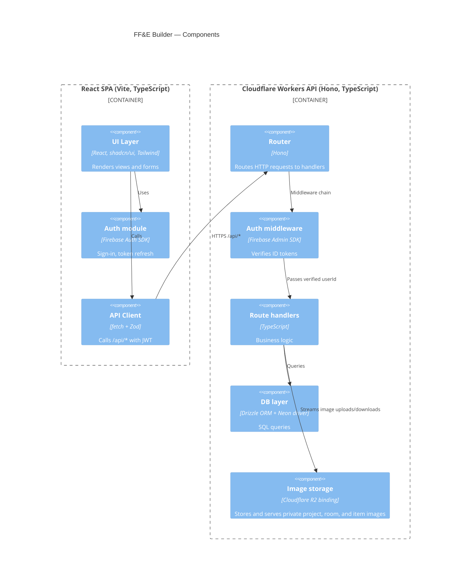
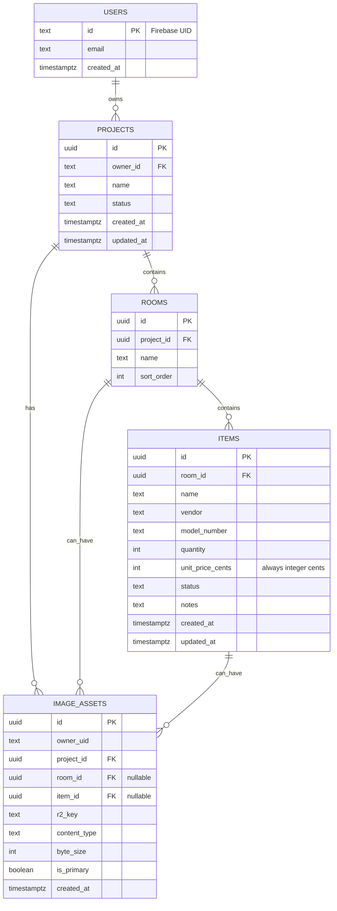

# Architecture

## 1. Context diagram (C4 Level 1)



---

## 2. Component diagram (C4 Level 2)



Actual frontend route shell:

- `/projects` renders project cards.
- `/projects/:id` redirects to `/projects/:id/table`.
- `/projects/:id/table` renders the editable grouped FF&E table.
- `/projects/:id/catalog` renders the printable one-item-per-page catalog.
- `/projects/:id/summary` renders totals by room, status, and vendor.
- `/signin` is public; project routes are protected by Firebase Auth.

The current launch build keeps demo fixture data for the visible project surface
while API, auth, ownership checks, migrations, and Worker deployment remain the
production integration boundary. The React client still never connects directly
to Neon.

Project, room, and item image bytes are stored in a private Cloudflare R2 bucket
named `ffe-images`. The Worker is the only R2 gateway: it validates Firebase
ownership against Neon image metadata before accepting uploads or returning image
content.

---

## 3. Sequence diagram — "user edits an item"

```mermaid
sequenceDiagram
  participant U as User
  participant W as React (GitHub Pages)
  participant F as Firebase Auth
  participant A as Worker (api.workers.dev)
  participant D as Neon Postgres

  U->>W: Click "Save"
  W->>F: Get current ID token
  F-->>W: ID token JWT
  W->>A: PATCH /api/v1/items/:id  (Bearer <token>)
  A->>F: verifyIdToken (Admin SDK)
  F-->>A: { uid: ... }
  A->>D: SELECT ownership; UPDATE item
  D-->>A: rows
  A-->>W: 200 OK { item }
  W-->>U: re-render
```

---

## 4. Entity-Relationship Diagram



---

## 5. Decisions

Architecture decisions are recorded as ADRs in [/docs/adr/](/docs/adr/).

| #                                        | Decision                                                                     | Status   |
| ---------------------------------------- | ---------------------------------------------------------------------------- | -------- |
| [0001](adr/0001-server-side-db-proxy.md) | Server-side DB proxy (Cloudflare Worker between client and Neon)             | Accepted |
| [0002](adr/0002-manual-types-for-now.md) | Hand-written TypeScript types; defer auto-generation until schema stabilizes | Accepted |
