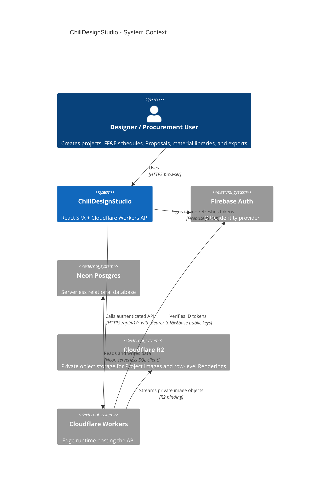
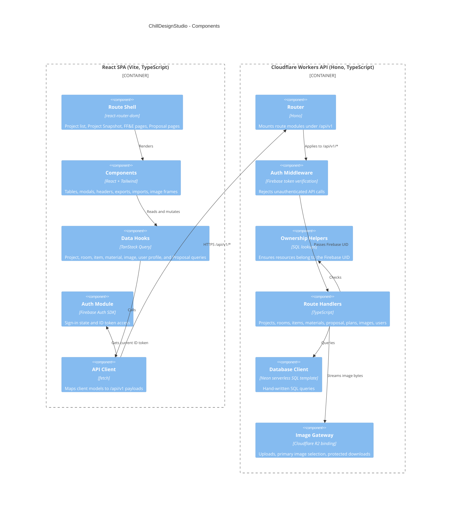
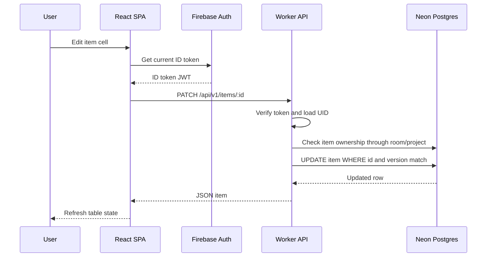
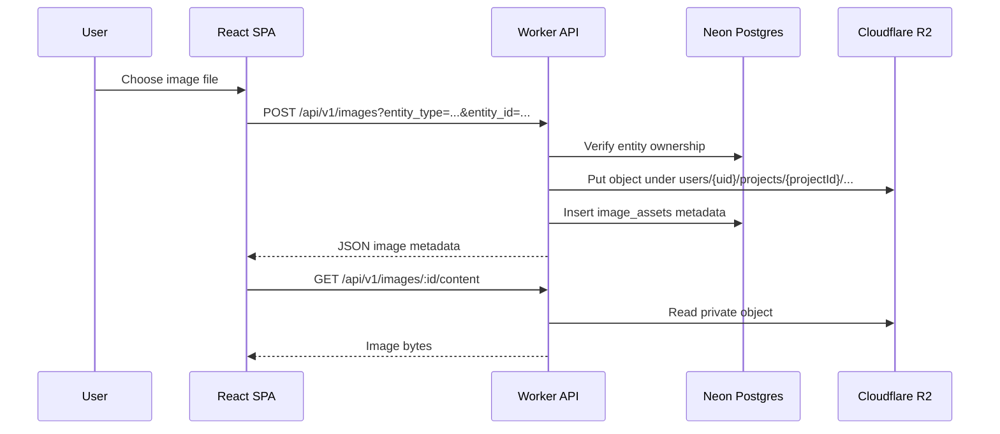
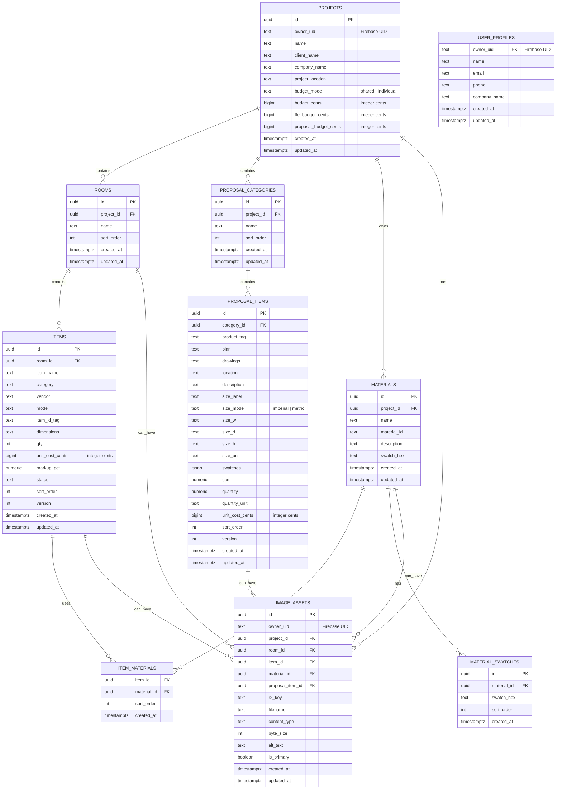

# Architecture

## 1. System Context



ChillDesignStudio is still stored in the `ffe-builder` repository. In domain language, FF&E is one tool inside the product; it is no longer the whole product shell. See [../CONTEXT.md](../CONTEXT.md) for canonical project terms.

## 2. Main Modules



The Worker uses hand-written SQL through `@neondatabase/serverless`; there is no current Drizzle schema in the repo. SQL migrations in `db/migrations/` are the database source of truth, and API/client TypeScript models are maintained manually.

## 3. Frontend Routes

- `/signin` is public.
- `/projects` lists projects, editable user information, and project image previews.
- `/projects/:id` redirects to `/projects/:id/snapshot`.
- `/projects/:id/snapshot` shows the read-first Project Snapshot landing page for the open Project.
- `/projects/:id/ffe/table` shows the editable FF&E table grouped by Room.
- `/projects/:id/ffe/catalog` shows printable FF&E catalog pages with inline item-text editing, option renderings, and customer approval markup.
- `/projects/:id/ffe/materials` shows the shared project material library from the FF&E tool.
- `/projects/:id/ffe/summary` shows FF&E budget and status summaries.
- `/projects/:id/proposal/table` shows the editable Proposal grouped by Proposal Category.
- `/projects/:id/proposal/materials` redirects to the shared project material library.
- `/projects/:id/proposal/summary` redirects to the project budget view.
- `/projects/:id/plans` shows the project-level Measured Plan library for architectural source images, selected PDF pages, and calibration readiness.
- `/projects/:id/plans/:planId` opens a project-scoped full-window plan workspace for protected-image viewing, plan switching, persisted calibration line editing, saved Length Line measurements, item-linked rectangle measurements, saved per-measurement crop framing, and derived plan-image saves for Proposal and FF&E items.

Legacy project routes continue to redirect to their current FF&E equivalents for compatibility.

## 4. API, Auth, And Storage Conventions

- Firebase Auth owns user identity. The client waits for auth readiness and sends the current ID token as `Authorization: Bearer <token>` on API calls.
- The Worker auth middleware protects all `/api/v1/*` routes. `/healthz` is public.
- The client never imports API worker code and never talks to Neon or R2 directly.
- The frontend API client is exposed through `src/lib/api.ts`; domain namespaces are incrementally implemented in `src/lib/api/` and re-exported through the facade so hooks can keep importing from `src/lib/api`.
- API client tests live alongside the focused `src/lib/api/` modules, with facade-level transport/auth coverage kept in `src/lib/api.test.ts`.
- Client utility modules are grouped by concern under `src/lib/` subfolders such as `api/`, `auth/`, `export/`, `images/`, `import/`, `items/`, `money/`, `plans/`, `projectSnapshot/`, `query/`, `theme/`, and `utils/`; only still-used root facades remain while callers migrate to canonical subfolder paths.
- Route modules live under `api/src/routes/`: `projects`, `plans`, `rooms`, `items`, `materials`, `proposal`, `images`, and `users`.
- Ownership is checked in the Worker with helper queries. Cross-user or missing resources return `404` to avoid leaking existence.
- Money is stored and transported as integer cents. See [money.md](money.md).
- Image bytes live in the private R2 bucket `ffe-images`; image metadata lives in Neon `image_assets`.
- Project-level Measured Plan source-image metadata lives in Neon `measured_plans`; the source image bytes also live in the private R2 bucket `ffe-images`. PDF uploads are stored as durable original PDFs plus one rendered selected page image per Measured Plan, so the existing calibration, measurement, crop, and item Plan Image workflow still operates on stable image-pixel geometry.
- Per-plan calibration metadata lives in Neon `plan_calibrations`; calibration line coordinates are stored in raw image-pixel space and downstream crop rectangles are also stored in raw image-pixel space on the associated measurement.
- Saved Length Line measurements live in Neon `length_lines`; line geometry is stored in raw image-pixel space and measured values are normalized into a canonical base unit before display conversion back into the plan calibration unit.
- Item-linked area measurements live in Neon `measurements`; rectangle geometry and optional crop framing are stored in raw image-pixel space, spans are normalized into the same canonical base unit, the client renders rotated highlight polygons from image-space corners rather than viewport-aligned rectangles, and saved crops can publish into `proposal_plan` or `item_plan` image surfaces.
- R2 object keys are user/project scoped. Current image entity types are `project`, `room`, `item`, `item_plan`, `item_option`, `material`, `proposal_item`, `proposal_plan`, and `proposal_swatch`. In domain language, the primary image attached to an FF&E Item or Proposal Item row is a Rendering; `item_plan` and `proposal_plan` store derived plan-image outputs, and `item_option` stores up to three alternate FF&E option renderings with one current selection.
- Measured Plan source images are not stored in `image_assets`; they are uploaded through `/api/v1/projects/:id/plans`, persisted on `measured_plans`, and stored in R2 under `users/{uid}/projects/{projectId}/plans/{planId}.{ext}`. For PDF-backed Measured Plans, the selected page is rendered client-side to a PNG at a stable scale and stored at that source-image key, while the original PDF is stored separately under the same user/project/plan scope for traceability.
- Project images are limited to three per Project, with one `is_primary` image used as the preview image in the project list and as the primary Project Image in exports.
- Proposal categories start empty for new projects and are created explicitly by users or imports.
- Proposal spreadsheet import is client-mediated: the React importer parses `.xlsx` workbooks for headers, sections, row values, and embedded image anchors, then persists categories/items through the Worker API and stores imported images through the existing private image/R2 endpoints.
- Spreadsheet import code keeps generic table parsing in `src/lib/import/engine.ts` and `src/lib/import/parser.ts`, with FF&E and Proposal adapters under `src/lib/import/formats/`.
- React Query cache keys are centralized in `src/hooks/queryKeys.ts`; hook callers import keys through the hooks barrels while implementation modules use the canonical definitions directly.
- Optimistic list mutation helpers live in `src/hooks/optimisticList.ts` so FF&E room/item hooks share snapshot, rollback, and list transform behavior.

## 5. Data Flow

### User edits an FF&E Item



### User uploads an image



## 6. Entity Relationship Diagram



## 7. Testing And Verification

Common local checks:

```bash
pnpm typecheck
pnpm lint
pnpm test
pnpm build
pnpm --filter ffe-api typecheck
pnpm --filter ffe-api test
```

Focused checks are preferred while iterating, for example:

```bash
pnpm exec vitest run src/components/ItemsTable.test.tsx
pnpm exec vitest run src/lib/export.test.ts
```

Database migrations are applied with:

```bash
pnpm migrate
```

The API Worker can be run locally with:

```bash
pnpm --filter ffe-api dev
```

## 8. Agent Guardrails

- Read `README.md`, `AGENTS.md`, this file, and `docs/changelog.md` before broad changes.
- Never commit automatically; provide a conventional commit message after changes.
- Do not run destructive commands or force-push without explicit confirmation.
- Keep the client/API boundary intact: `src/` must not import from `api/`, and `api/` must not import from `src/`.
- Put domain types in `src/types/` and export them from `src/types/index.ts`.
- Put hooks in `src/hooks/` and export them from `src/hooks/index.ts`.
- Put reusable UI primitives in `src/components/primitives/` and export them from its barrel.
- Update docs and `docs/changelog.md` when feature behavior, public APIs, env vars, file structure, or dependencies change.
- Keep monetary values as integer cents from DB through API and application state.

## 9. Decisions

Architecture decisions are recorded as ADRs in [adr/](adr/).

| #                                              | Decision                                                                  | Status   |
| ---------------------------------------------- | ------------------------------------------------------------------------- | -------- |
| [0001](adr/0001-server-side-db-proxy.md)       | Server-side DB proxy between the client and Neon                          | Accepted |
| [0002](adr/0002-manual-types-for-now.md)       | Hand-written TypeScript types; defer generation until schema pain is real | Accepted |
| [0003](adr/0003-no-storybook-yet.md)           | No Storybook in v1; rely on focused tests and written design-system docs  | Accepted |
| [0004](adr/0004-project-scoped-tool-models.md) | Keep FF&E and Proposal as separate project-scoped data models             | Accepted |
